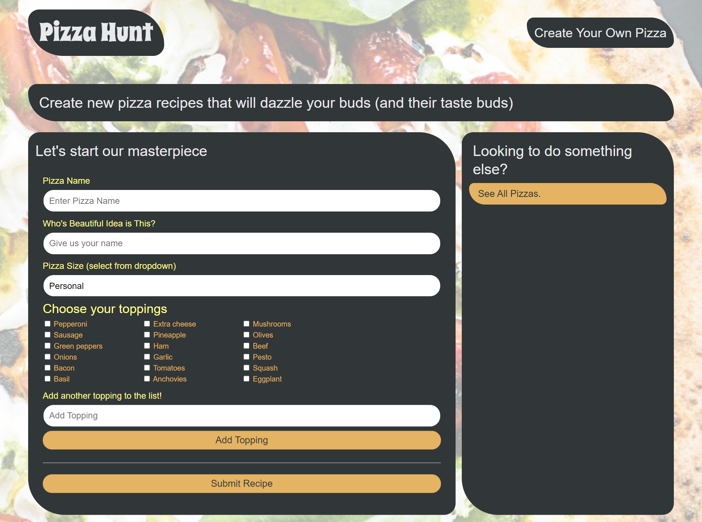

# pizza-hunt

## Screenshot:

## DESCRIPTION: 

Users can create, read, update, and delete data for a pizza in the database.
- As a user, I can create and customize my own unique pizza
- As a user, I can retrieve data about my pizzas or other pizzas created through the app

Users can create, read, update, and delete data for a pizza's comment in the database
- As a user, I want to be able to see what pizza has been created on the site and how many existing comments it has
- As a user, I want to be able to leave a comment on a pizza that has been created

Add Pizza Discussion
- As a user, I want to be able to see comments on a pizza
- As a user, I want to be able to reply to a comment

Add Offline Capabilities
- As a user, I would like to be able to use this application with little or no internet access and still have core functionality available

Add Data Validation
- As a user, I want to ensure I'm not missing any important data for creating a pizza or comment

## TECHNICAL DESCRIPTION: 
- mongoDB (mongoose), indexedDB and Sequelize is used.
